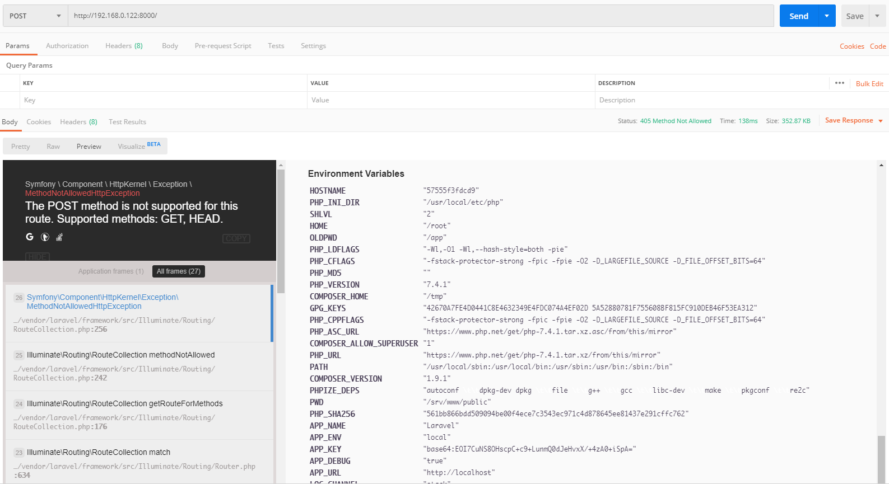

# Laravel 5 with debug turn on

## Environment Setup

Enter the following command：(Laravel version:5.8.*)

```
docker-compose up -d
```

Visit `http://your-ip:8000` and you'll see the default page of Laravel.

## POC

Visit `http://your-ip:8000/` with `POST` method and it'll show the .env's content：



## Links

Composer Mirrors: https://developer.aliyun.com/composer

Laravel 5.8: https://laravel.com/docs/5.8
